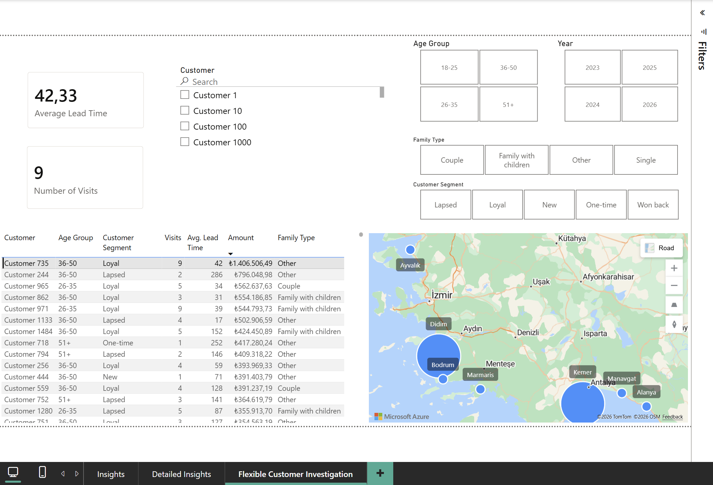
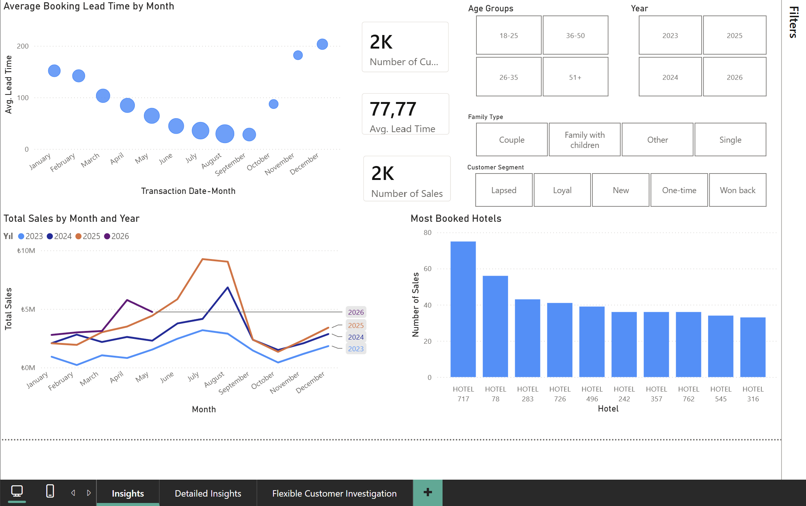
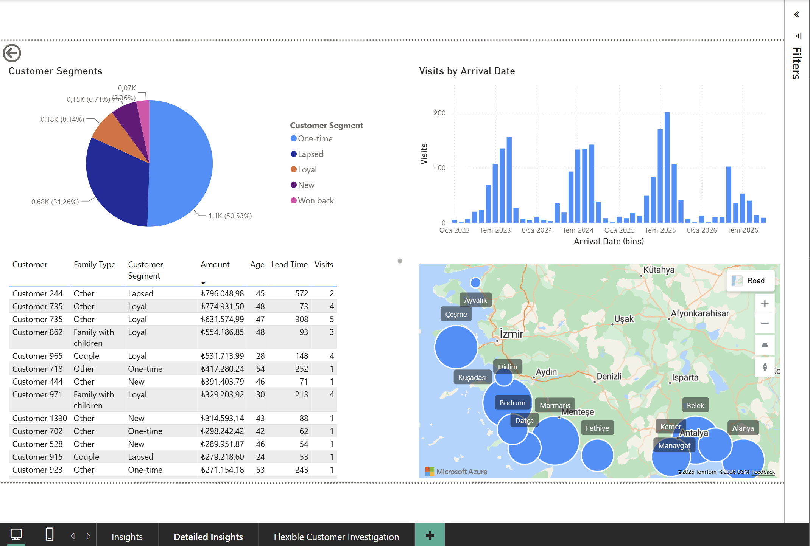

# Dashboard

Three report pages, built in Power BI. The data shown is synthetic: names, hotels, and amounts are anonymized, and hotel locations are randomized. The structure, logic, and findings are from the real report, which is in use by the sales team.

---

## Flexible Customer Investigation



The page the sales team actually works from. Search for a customer by name, or filter by age, family type, year, and segment to get the set of people who match, then read each one's spending, visit count, lead time, and where they've traveled.

This is the difference between a report someone glances at and a tool someone uses. It doesn't summarize the past; it answers "who should I call, and what do I already know about them" before the call.

---

## Insights



The overview page.

**Average booking lead time by month** traces a U: January purchases sit far ahead of travel, the gap closes to about a month by high summer, then widens again toward year end. Much of that shape is mechanical, since almost everyone travels in summer, so a January booking is simply forced to sit far ahead of its trip. The part worth reading is at the edges, where late-year bookings for the next summer appear.

**Total sales by month and year** shows the seasonal peak repeating across years, with each year layered so the shape is comparable rather than just a running total.

**Most booked hotels** ranks demand, which feeds the recommendation idea: knowing what customers of a given profile actually book turns an open-ended sales conversation into a short list.

---

## Detailed Insights



The same analysis, filterable. **Customer segments** breaks the base down by lifecycle state, and the distribution is the point: roughly half the customers are one-time, and only a small slice are loyal, which is exactly why "who are our loyal customers" was worth asking. **Visits by arrival date** shows the seasonal booking rhythm, and the table and map let you drill into any segment.

---

## How the segmentation is defined

The lifecycle segmentation is a DAX calculated column. It counts each customer's bookings across three windows (this year, last year, everything older) and assigns a state from the combination:

```dax
Customer Segment = 
VAR CurrentYear = 2026
VAR PreviousYear = CurrentYear - 1

VAR CurrentSeasonPurchases = 
    CALCULATE(
        COUNTROWS(Rezervasyonlar),
        ALLEXCEPT(Rezervasyonlar, Rezervasyonlar[Ad Soyad]),
        Takvim[Yıl] = CurrentYear
    )

VAR PreviousSeasonPurchases = 
    CALCULATE(
        COUNTROWS(Rezervasyonlar),
        ALLEXCEPT(Rezervasyonlar, Rezervasyonlar[Ad Soyad]),
        Takvim[Yıl] = PreviousYear
    )

VAR OlderPurchases = 
    CALCULATE(
        COUNTROWS(Rezervasyonlar),
        ALLEXCEPT(Rezervasyonlar, Rezervasyonlar[Ad Soyad]),
        Takvim[Yıl] < PreviousYear
    )

VAR NetCurrentSeason = COALESCE(CurrentSeasonPurchases, 0)
VAR NetPreviousSeason = COALESCE(PreviousSeasonPurchases, 0)
VAR NetOlder = COALESCE(OlderPurchases, 0)
VAR TotalPastPurchases = NetPreviousSeason + NetOlder

RETURN
SWITCH(
    TRUE(),
    ISBLANK(Rezervasyonlar[Ad Soyad]), BLANK(),
    TotalPastPurchases = 0, "New",
    NetCurrentSeason > 0 && NetPreviousSeason > 0, "Loyal",
    NetCurrentSeason = 0 && TotalPastPurchases = 1, "One-time",
    NetCurrentSeason = 0 && TotalPastPurchases > 1, "Lapsed",
    NetCurrentSeason > 0 && NetPreviousSeason = 0 && NetOlder > 0, "Won back",
    "Other"
)
```

Column and table names are Turkish because they carry through from the source data; the state labels are translated here for readability.
